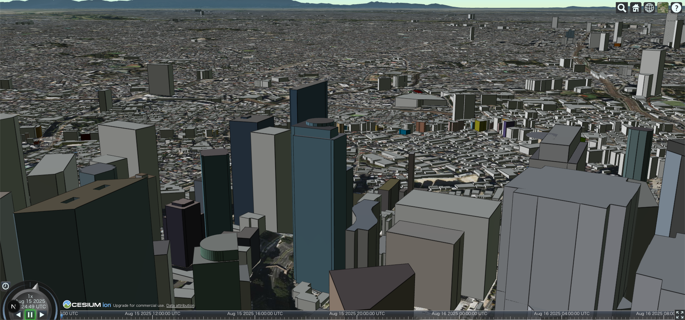

cesiumjs 練習用リポジトリ

## Getting Started

起動までに必要なセットアップ

node_modulesのインストール
※node_modulesのインストールの後にcesium系の資材をpublicにコピーされる

```bash
npm i
```

開発サーバの起動
```bash
npm run dev
```

## 画面

### ホーム画面  
各機能のサンプルに遷移する

```
http:localhost:3000/
```

### 3d tiles 
3Dタイルのサンプル画面
```
http://localhost:3000/feature/3d_tiles
```



### google 3d tiles
google map apiを利用した3Dタイル。すごい綺麗  
ただ普通の3d tilesより少し重い


## Deploy on Vercel

The easiest way to deploy your Next.js app is to use the [Vercel Platform](https://vercel.com/new?utm_medium=default-template&filter=next.js&utm_source=create-next-app&utm_campaign=create-next-app-readme) from the creators of Next.js.

Check out our [Next.js deployment documentation](https://nextjs.org/docs/app/building-your-application/deploying) for more details.
